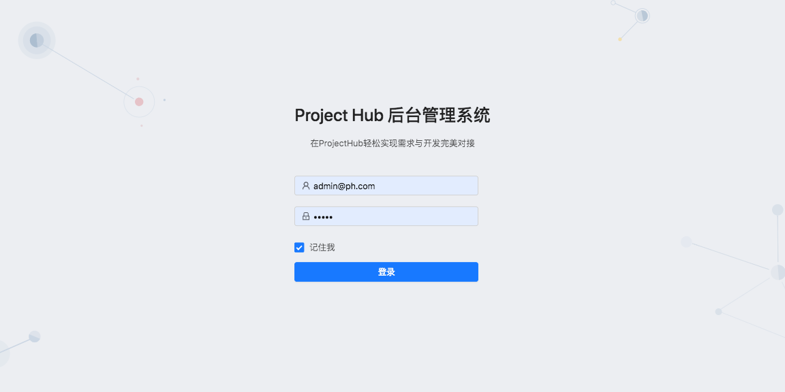
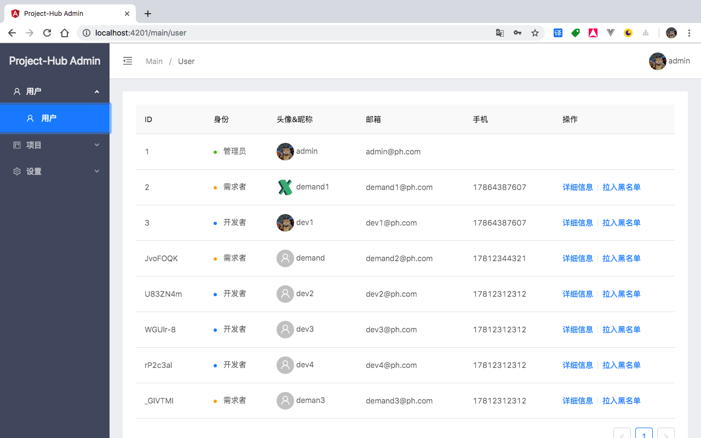
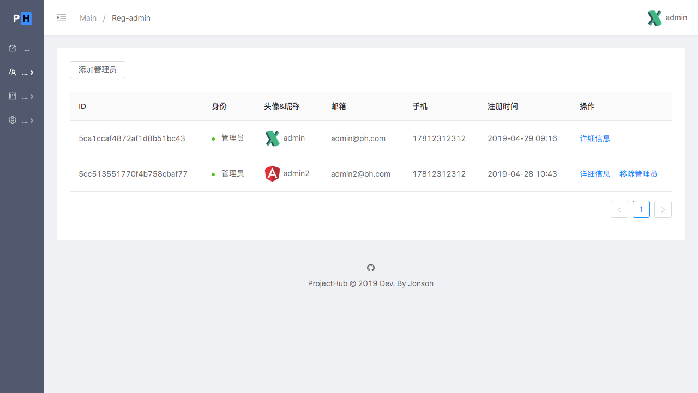
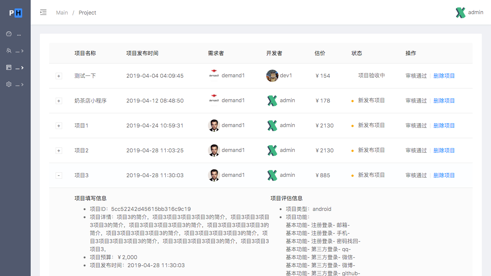
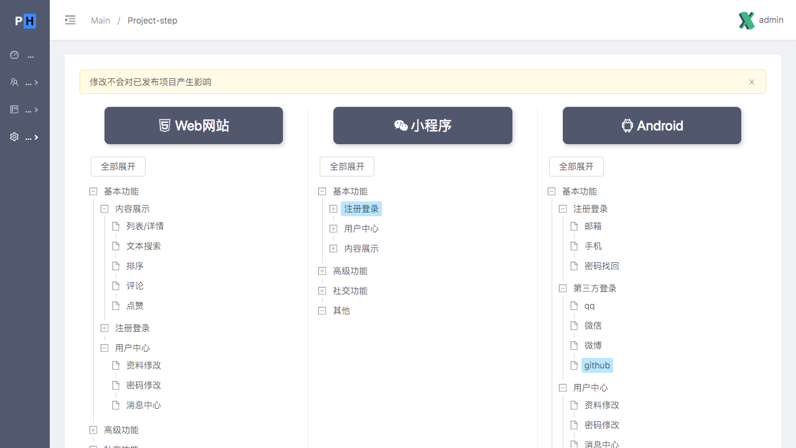
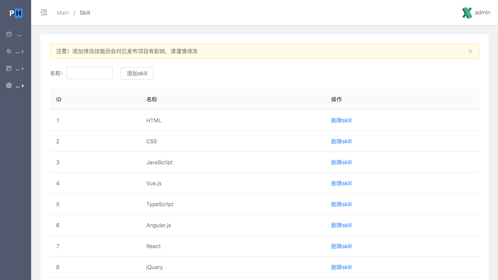

# ProjectHub Admin


这个项目是我在学习 angular 时做的，同时临近毕业打算作为毕业设计。项目分为 [移动客户端](https://github.com/xjonson/ProjectHub-Client-Mobile)、[PC端后台管理](https://github.com/xjonson/ProjectHub-Admin)、[server端](https://github.com/xjonson/ProjectHub-BackEnd)。这是PC端后台管理。


## 介绍

- 使用了 [ng-zorro](https://ng.ant.design/) 组件库、[viser-ng](https://www.yuque.com/rs385i) 可视化图表，参照了 [ng-alain](https://github.com/ng-alain/ng-alain)的一些设计。
- ~~当前使用fake api，将来会使用node代替~~已经使用node后端提供api
- 管理员可进行登录，登录后可在dashboard页面看到近2周的页面访问量、用户量、项目量的统计
- 可对用户进行注册审核、查看信息的处理
- 可对项目进行查看信息、审核发布的处理
- 设置平台的静态数据如 技能列表 等


## 开发环境

- Node.js v8.9.4
- Angular v7.3.0
- Angular Material v7.2.0
- TypeScript v3.2.2
- json-server v0.14.2


## 使用

请先确保你已拥有以上环境

```bash
git clone git@github.com:xjonson/ProjectHub-Admin.git
```

```bash
cd ProjectHub-Admin
```

```bash
npm install
```

```bash
npm run dev
```

然后打开 [http://localhost:4200/](http://localhost:4200/) 即可预览效果

server端api请[移步这里](https://github.com/xjonson/ProjectHub-BackEnd)

## 展示

登录
<br>

<br>
仪表盘
<br>

<br>
用户列表
<br>

<br>
管理员列表
<br>

<br>
项目列表
<br>

<br>
项目估价元数据
<br>

<br>
技能元数据
<br>

<br>
